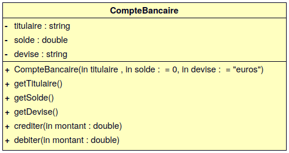
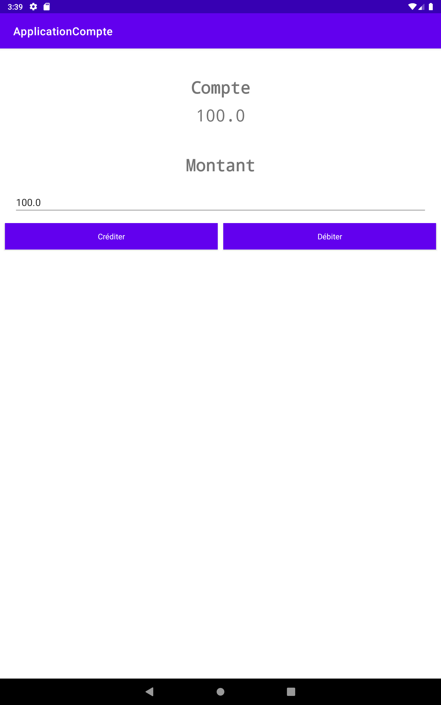

  

[](../../actions)

# TP POO : Android

- [TP POO : Android](#tp-poo--android)
  - [Android](#android)
  - [Android Studio](#android-studio)
  - [Travail demandé](#travail-demandé)
  - [Tests unitaires](#tests-unitaires)


Les objectifs de ce TP sont de s’initier à la programmation Dart en transférant ses connaissances de la programmation orientée objet.

> Pour les enseignants, ceci est un "petit" devoir pour [Github Classroom](https://btssn-lasalle84.github.io/guides-developpement-logiciel/guide-classroom.html). Il montre l'utilisation des tests unitaires en Dart, la notation automatique et l'insertion d'un badge pour l'affichage de la note.

## Android

**Android** est un système d'exploitation mobile basé sur le noyau Linux et développé actuellement par Google.

> D'abord été conçu pour les smartphones et tablettes tactiles, Android s'est ensuite diversifié dans les objets connectés et ordinateurs comme les télévisions (Android TV), les voitures (Android Auto), les Chromebook (Chrome OS qui utilise les applications Android) et les smartwatch (Wear OS).

Lien : [Les différentes versions d'Android](https://fr.wikipedia.org/wiki/Android#Versions)

Android est défini comme étant une pile de logiciels organisée en cinq couches distinctes :

- un système d'exploitation (comprenant un noyau Linux avec les pilotes) ;
- des bibliothèques logicielles telles que WebKit, OpenGL, SQLite, ... ;
- un environnement d'exécution et des bibliothèques permettant d'exécuter des programmes prévus pour la plate-forme *Java* ;
- un kit de développement d'applications (*SDK*) ;
- des d'applications standards (un environnement de bureau, carnet d'adresses, application téléphone, ...).

Les différents kits de développement sont :

- l'Android **NDK** (_Android Native Development Kit_) est une API du système d'exploitation Android permettant de développer directement dans le langage C/C++ du matériel cible, par opposition au Android SDK qui est une abstraction en _bytecode_ **Java**, indépendante du matériel.

- l'Android **SDK** (_Software Development Kit_) est un ensemble complet d'outils de développement (pour Linux, MAC OS ou Windows). Il inclut un débogueur, des bibliothèques logicielles, un émulateur basé sur QEMU, de la documentation, des exemples de code et des tutoriaux.

L'**ADB** (_Android Debug Bridge_) est un outil inclus dans le package Android SDK. Il se compose d'un programme client et d'un programme serveur communicant entre eux et qui permet :

- la copie de fichier ;
- l'accès à la console Android ;
- la sauvegarde de la mémoire ROM ;
- l'installation de logiciel.

**Pour développer des applications Android, il faut au moins disposer du Android SDK et du kit de développement Java (JDK).** Pour faciliter le développement, il est conseillé d'utiliser un EDI/IDE (_Integrated Development Environment_) comme __Android Studio__.

Ces outils sont disponibles aussi bien sous Linux que sous Windows et Mac OS. Les applications Android étant exécutées par une machine virtuelle, il n'y a pas d'avantages particuliers à développer sur un système plutôt qu'un autre ...

Java est le langage de programmation "officielle" pour développer des applications Android.

Jusqu'à sa version 4.4, Android comporte une machine virtuelle nommée Dalvik, qui permet d'exécuter des programmes prévus pour la plate-forme Java.

Le processus de construction d'une application Android est le suivant : le code source Java de l'application est tout d'abord compilé avec un compilateur standard pour produire un _bytecode_ standard pour JVM puis celui-ci est traduit en _bytecode_ pour Dalvik par un programme inclus dans Android.

À partir de la version 5.0 (Lollipop) sortie en 2014, l'environnement d'exécution *ART* (_Android RunTime_) remplaça la machine virtuelle Dalvik. Cet environnement d'exécution plus performant fut développé par Google pour pallier le potentiel limité de Dalvik (créé en 2007). Avec ART, les fichiers de _package_ d'application Android (une archive portant l'extension `.apk`) ne sont plus lancés directement mais décompressés et lancés avec de nouvelles bibliothèques et API.

> Google annonce en 2017 que le langage **Kotlin** devient le second langage de programmation officiellement pris en charge par Android après Java. Kotlin est un langage de programmation orienté objet qui permet de compiler pour la machine virtuelle Java. Son développement provient principalement d'une équipe de programmeurs chez JetBrains (un éditeur de logiciels qui fournit l'IDE IntelliJ).

## Android Studio

**Android Studio** est un environnement de développement pour développer des applications Android. Il est basé sur IntelliJ.

Android Studio permet principalement d'éditer les fichiers Java (ou Kotlin) et les fichiers de configuration d'une application Android.

Il propose entre autres des outils pour gérer le développement d'applications multilingues et permet de visualiser la mise en page des écrans sur des écrans de résolutions variées simultanément.

Liens :

- [Installation Android Studio 4.1 (Ubuntu 20.04)](http://tvaira.free.fr/dev/android/installation-android.html)
- [Guide de démarrage Android](http://tvaira.free.fr/dev/android/guide-demarrage-android.html)

## Travail demandé

On souhaite disposer du concept de `Compte`.

Un `Compte` doit posséder un titulaire, un solde et une devise (EUR, USD, ...). Il est possible d’obtenir le nom du titulaire ainsi que le solde et la devise de ce solde. Lorsque l’on crée un compte, il est possible de préciser le nom du titulaire, le solde initial et la devise ou simplement le nom du titulaire et il aura un solde nul et une devise EUR par défaut.

On pourra :

- `crediter()` d'un `montant` passé en argument le solde du `Compte`
- `debiter()` d'un `montant` passé en argument le solde du `Compte`



Fournir la classe `Compte` dans `app/src/main/java/com/lasalle/applicationcompte/CompteBancaire.java`.

Réaliser une application Android exploitant le concept de `Compte` :



## Tests unitaires

Lancement des tests :

```sh
$ cd ApplicationCompte

$ ./gradlew :app:testDebugUnitTest --tests com.lasalle.applicationcompte.TestCompteAccesseurs

$ ./gradlew :app:testDebugUnitTest --tests com.lasalle.applicationcompte.TestCompte
```

---
Thierry Vaira : **[thierry(dot)vaira(at)gmail(dot)com](mailto:thierry.vaira@gmail.com)**
